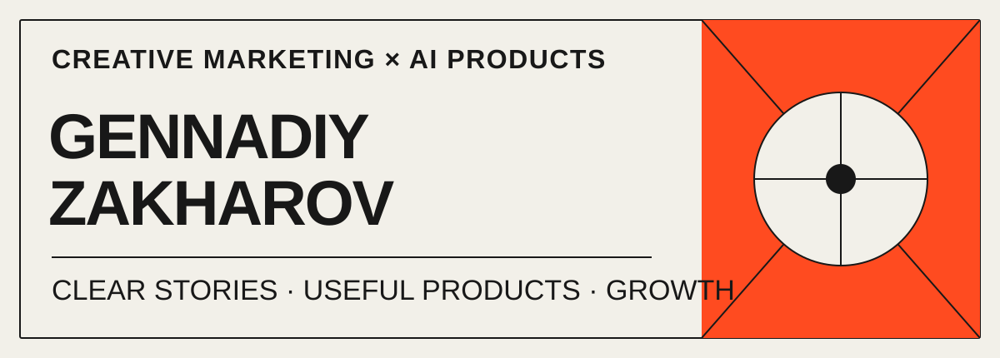

  

  <a href="https://zakharov.asia/">Portfolio</a>
  &nbsp;·&nbsp;
  <a href="https://zakharov.asia/en/">English</a>
  &nbsp;·&nbsp;
  <a href="https://t.me/tsifranuty_me">AI media</a>
  &nbsp;·&nbsp;
  <a href="https://www.linkedin.com/in/zaharov-gennady/">LinkedIn</a>

## I make complex technology easier to understand — and easier to choose.

I’m **Gennadiy Zakharov**, a creative marketing specialist and product builder based in Almaty, working across Europe and Asia. Since 2016, I’ve connected strategy, research, content, analytics, and digital products — from international organisations and consumer brands to AI startups and my own apps.

My GitHub is the workshop behind that practice: small, useful products built around real communication problems.

<table>
  <tr>
    <td width="33%"><strong>10 years</strong> in digital marketing</td>
    <td width="33%"><strong>300+ projects</strong> strategy, growth & education</td>
    <td width="33%"><strong>56.3K followers</strong> 1.27M combined reach</td>
  </tr>
</table>

## Products from my workbench

### [GZWhisper](https://github.com/globa-me/GZWhisper)

Local-first transcription for macOS, with an experimental Linux build. Turns audio and video into usable text with faster-whisper — without sending the source material away. 
`Swift` · `Whisper` · `Privacy-first`

### [Link2Download](https://github.com/globa-me/Link2Download)

A native macOS downloader for video and audio, powered by yt-dlp, with a Windows preview port. One focused job, without command-line friction. 
`Swift` · `macOS` · `Media tools`

### [SubCopy](https://github.com/globa-me/SubCopy)

A browser tool for collecting YouTube captions, thumbnails, and video details in one click — built for research and content workflows. 
`JavaScript` · `Browser extension` · `Creator tools`

### [Screendance](https://github.com/globa-me/Screendance-App)

An Apple Silicon-focused maintained fork of Recordly, currently in development; no public build yet. Its aim: turn what happens on screen into clear, publishable stories. 
`Maintained fork` · `macOS` · `In development`

### On the private workbench

- **GZWhisper for iPhone** — private beta: offline recording, transcription, translation, and local AI chat.
- **Mentum.Guru** — in development: AI practice for professional skills through real work scenarios.
- **Botable** — private experiments in generating useful Telegram products with AI.

## Marketing is the operating system

I don’t build software to collect technologies. I build it to remove friction from a human journey: finding a message, understanding a product, making content, learning a skill, or finishing a repetitive task.

That perspective comes from leading and delivering work across:

- **Strategy & growth:** positioning, go-to-market, acquisition, partnerships.
- **Creative & communication:** brand systems, content, SMM, PR, education.
- **Research & product:** CJM, analytics, UX, SEO, AI integrations.

Recent work includes growth and positioning for **GPTunneL AI**, regional digital marketing for **Goethe-Institut**, product strategy for **AskDou.ai** and **Storista AI**, and digital product work for **Philip Morris International** and **Chocofood**. [Explore the cases →](https://zakharov.asia/projects/)

## I explain AI in human language

Through **«Цифранутый»**, I test tools, unpack shifts in AI and digital products, and share what is actually useful for creators, marketers, and teams.

- [**TikTok — 30.8K followers · 620K reach**](https://www.tiktok.com/@tsifranuty)
- [**Instagram — 17K followers · 500K reach**](https://www.instagram.com/globa_me/)
- [**YouTube — 2.5K subscribers · 70K reach**](https://www.youtube.com/@tsifranuty)
- [**Facebook — 6K followers · 80K reach**](https://www.facebook.com/gennadij.zaharov/)

[Telegram](https://t.me/tsifranuty_me) · [LinkedIn](https://www.linkedin.com/in/zaharov-gennady/)

---

**Have a product that is hard to explain — or ready to grow?** 
Let’s turn its complexity into a clear strategy, story, and experience. [Discuss a project →](https://t.me/m/2jN7pTPqMmEy)

ALMATY · EUROPE / ASIA · RU / EN

